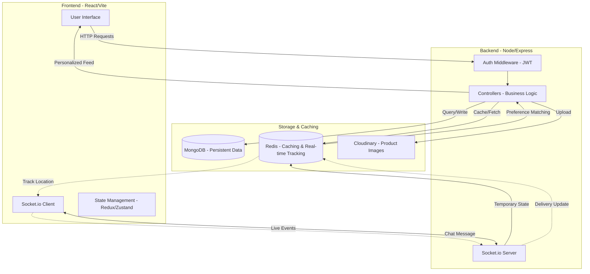

# System Architecture & Event Flow

This diagram illustrates the high-level interaction between the Frontend, Backend, Database, Redis, and Real-time Sockets.

## Detailed Data Flow

1. **User Login**: Frontend → JWT → Backend → DB check. Token stored in HTTP-only cookie.
2. **Product Recommendation**:
   - User clicks product → Backend increments "Click Score" in **Redis**.
   - Redis calculates "Popular in [Category]" using Sorted Sets.
   - Frontend fetches results from Redis (Latency < 5ms).
3. **Chat Integration**:
   - Sender → Socket.io (Server) → Save to MongoDB (Async) → Emit to Receiver.
4. **Product Tracking**:
   - Carrier Agent shares Location → Socket.io → Update coordinate in **Redis Geospatial Index**.
   - User fetches "Where is my product?" → Backend queries Redis for latest coordinate → UI displays on Map.
